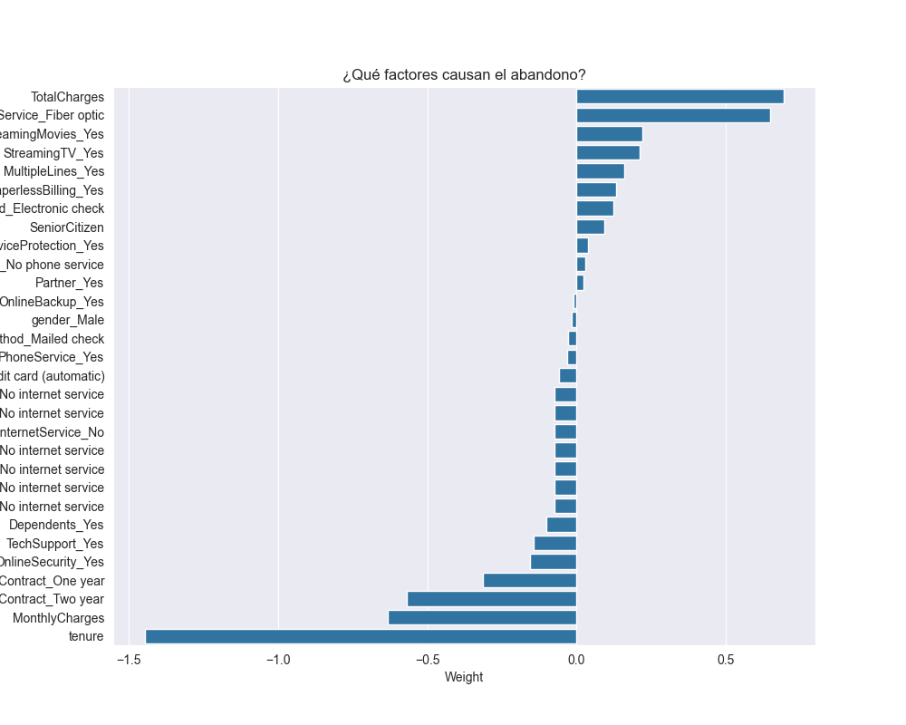

# 📉 Customer Churn Prediction
> Predicción de abandono de clientes en Telecomunicaciones usando Machine Learning.


## 📖 Descripción del Proyecto
Este proyecto tiene como objetivo identificar a los clientes de una empresa de telecomunicaciones que tienen una alta probabilidad de abandonar el servicio ("Churn").

Utilizando un dataset de **7,000+ clientes** y algoritmos de **Machine Learning (Regresión Logística)**, construimos un modelo predictivo capaz de detectar el riesgo de fuga con una exactitud del **~79%**. Esto permite a la empresa tomar acciones preventivas y reducir costos de adquisición.

---

## 📊 Resumen Ejecutivo 

### 🚩 El Problema
La adquisición de un nuevo cliente es entre **5 y 25 veces más costosa** que retener a uno existente. La empresa necesita entender **por qué** sus clientes se van y **quiénes** serán los próximos.

### 💡 La Solución
Se desarrolló un pipeline de datos completo que incluye limpieza, ingeniería de características y modelado predictivo.

**Hallazgos Clave de Negocio:**
1.  **Factor #1 de Fuga:** Los usuarios con servicio de **Internet de Fibra Óptica** son los más propensos a cancelar. (Posible indicador de mala calidad técnica o precio elevado).
2.  **Retención:** Los contratos a **2 años** reducen drásticamente la probabilidad de fuga.
3.  **Sensibilidad al Precio:** Clientes con **cargos mensuales altos** tienden a irse más rápido.

### 📈 Resultados del Modelo
* **Modelo:** Logistic Regression (Scikit-Learn).
* **Accuracy:** 78.75% (En datos de prueba desconocidos).
* **Despliegue:** El modelo fue exportado (`.pkl`) y está listo para simular predicciones en producción.

---

## 🛠️ Estructura del Proyecto
El proyecto sigue la estructura estándar de *Cookiecutter Data Science* para garantizar reproducibilidad.

```text
├── data
│   ├── raw            # Datos originales (Telco-Customer-Churn.csv) - INMUTABLE
│   ├── interim        # Datos limpios y corregidos
│   └── processed      # Datos transformados (One-Hot Encoded) listos para el modelo
│
├── models             # Modelos serializados (.pkl)
│
├── notebooks          # Jupyter Notebooks paso a paso
│   ├── 0.0-carga-inicial.ipynb          # Ingesta y validación
│   ├── 0.1-eda.ipynb                    # Análisis Exploratorio Visual
│   ├── 0.2-feature-engineering.ipynb    # Transformación de datos
│   ├── 0.3-modelado.ipynb               # Entrenamiento y Evaluación
│   └── 0.4-despliegue.ipynb             # Simulación de Producción
│
├── reports            # Reportes generados PDF y figuras
│   ├── figures        # Gráficos y visualizaciones
│   └── Customer_Churn_Report.pdf        # Reporte final en PDF
│
└── README.md          # Documentación del proyecto
```
---

## 🚀 Cómo Ejecutar el Proyecto
### Requisitos Previos
Necesitas tener instalado Python 3.8+ y las siguientes librerías:
- pandas
- numpy
- scikit-learn
- seaborn
- matplotlib
- jupyter

### Instrucciones
1. Clona este repositorio:
   ```bash
   git clone https://github.com/LordAguaKate/Customer-Churn-Prediction.git 
   ```
2. Navega al directorio del proyecto:
   ```bash
    cd Customer-Churn-Prediction
    ```
3. Crea y activa un entorno virtual ¡Importante!: Para evitar conflictos con otras librerías de tu sistema.
    ```bash
     # En Windows:
    python -m venv .venv
    .\.venv\Scripts\Activate
    
    # En Mac/Linux:
    python3 -m venv .venv
    source .venv/bin/activate
     ```
4. Instala las dependencias:
   ```bash
    pip install -r requirements.txt
    ```
5. Abre Jupyter Notebook:
   ```bash
    jupyter lab
    ```
--- 
## ✒️ Autor
**Jesús Gpe Rivera Meza**

- Data Scientist & Software Engineer

- [LinkedIn](www.linkedin.com/in/rivera-meza) | [GitHub](https://github.com/LordAguaKate)